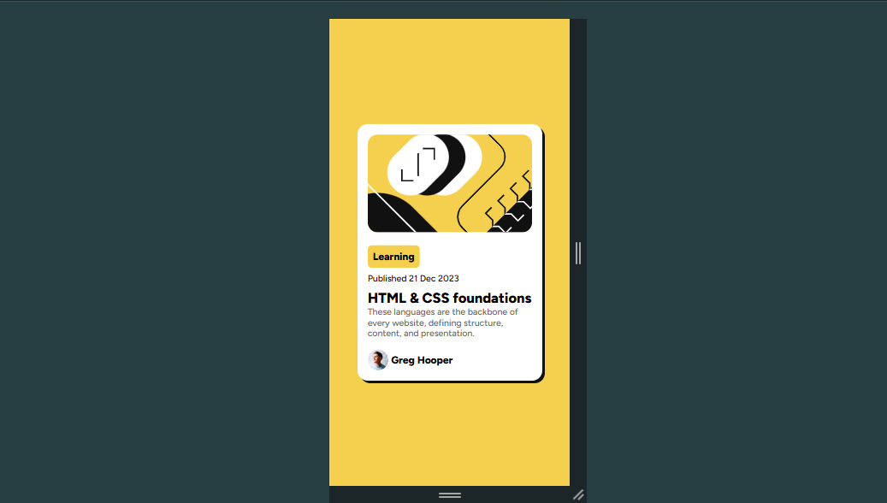

## Table of contents

- [Overview](#overview)
  - [Screenshot](#screenshot)
  - [Links](#links)
- [My process](#my-process)
  - [Built with](#built-with)
  - [What I learned](#what-i-learned)
- [Author](#author)

## Overview
Frontend mentor challenge featuring hover and focus states for all interactive elements on the page

### Screenshot

### Links

- Solution URL: https://github.com/stephenakinrodoye/blog-review-card.git
- Live Site URL: https://blog-review-card-steel.vercel.app/

## My process
Write the markup
Add CSS styles
Added media query for mobile responsiveness

### Built with

- Semantic HTML5 markup
- CSS custom properties
- Flexbox

### What I learned

Use of hover pseudoclass

## Author

- Website - [Stephen Akinrodoye](https://stephenakinrodoye-dev.vercel.app/)
- Frontend Mentor - [@stephenakinrodoye](https://www.frontendmentor.io/profile/stephenakinrodoye)
- Twitter - [@Stephen_Akinrod](https://x.com/Stephen_Akinrod)